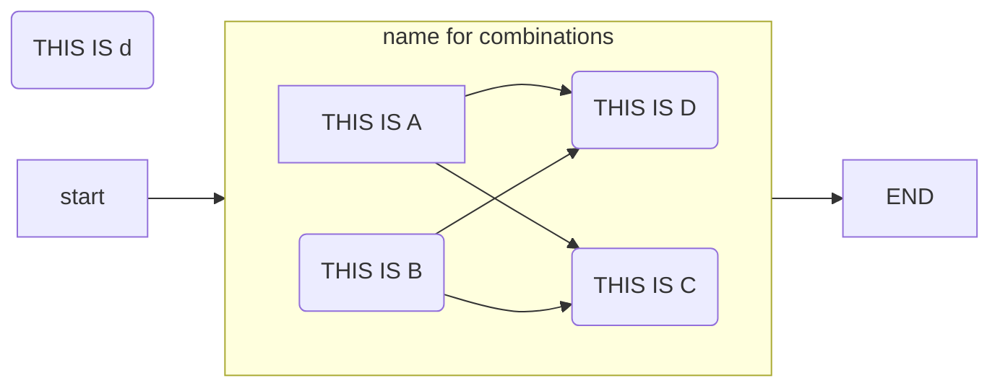
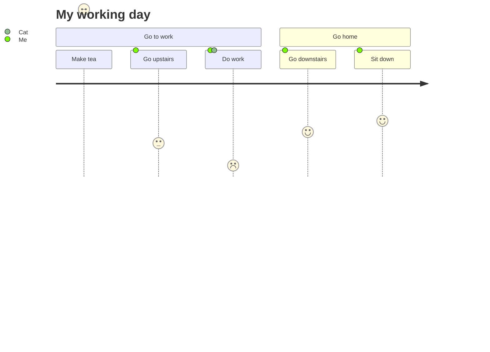
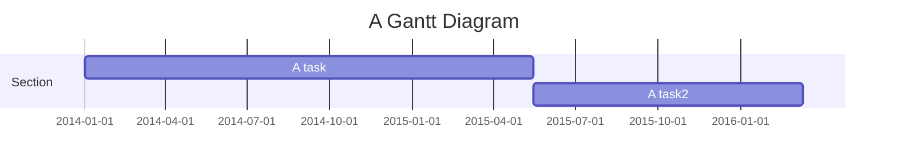

# Reference alignment workflow

## an example run script

```
configfile=config/config.yaml
threads=200
snakemake --configfile $configfile --cores $threads --use-conda -p
```

Or if you want to distribute over a cluster:

```
mkdir dir -p logs/drmaa
configfile=config/config.yaml
threads=200
snakemake --configfile $configfile --jobs $threads --use-conda -p  \
    --drmaa " -l centos=7 -l h_rt=48:00:00 -l mfree=8G -pe serial {threads} -V -cwd -S /bin/bash -w n" --drmaa-log-dir logs/drmaa
```

Or if you want to make ideograms:

```
configfile=config/config.yaml
threads=200
snakemake --configfile $configfile --cores $threads --use-conda -p ideogram
```






